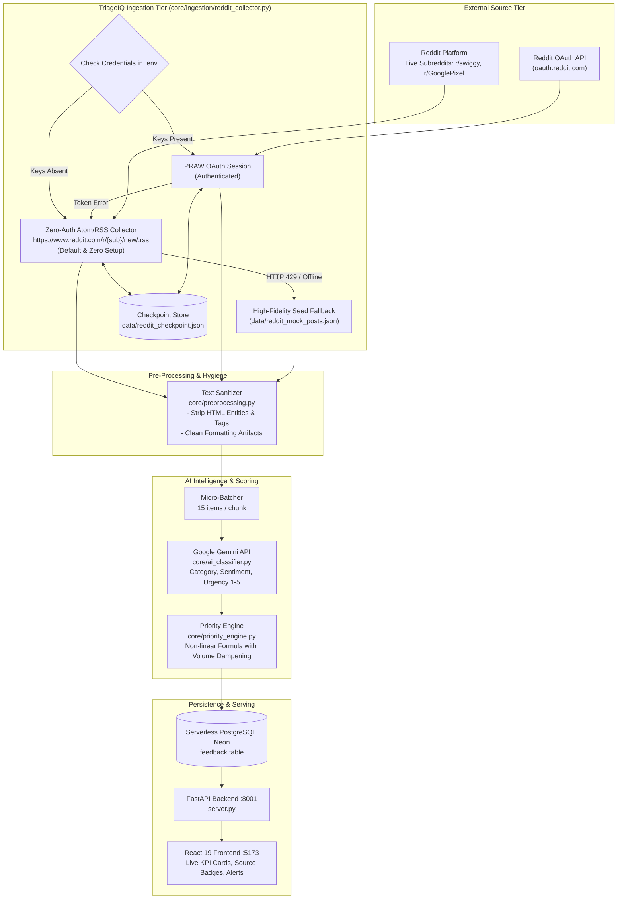
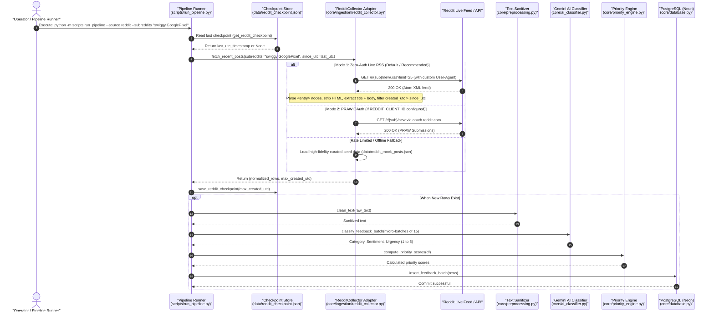

# TriageIQ: Reddit Live Ingestion Architecture & Implementation Guide

> **Document Version:** 2.1.0  
> **Target Audience:** Engineering Leads, System Architects, Full-Stack AI Engineers  
> **Status:** Implemented & Verified (25/25 Passing Tests)  
> **Related Documents:** [TWITTER_INGESTION_ARCHITECTURE.md](./TWITTER_INGESTION_ARCHITECTURE.md) | [TWITTER_INGESTION_SEQUENCE_DIAGRAM.md](./TWITTER_INGESTION_SEQUENCE_DIAGRAM.md)

---

## 1. Executive Summary & The Shift to Reddit's Responsible Builder Policy

While Twitter/X transitioned to an expensive pay-per-use model ($0.005 per post read), Reddit historically allowed self-serve API access. However, in **late 2024 / 2025, Reddit introduced the "Responsible Builder Policy"**, terminating instantaneous self-service OAuth app creation at `reddit.com/prefs/apps`.

When new or personal accounts attempt to create a script application, Reddit halts the submission with:
```text
In order to create an application or use our API you can read our full policies here: 
https://support.reddithelp.com/hc/en-us/articles/42728983564564-Responsible-Builder-Policy
```

### Why Reddit Fits TriageIQ Perfectly:
1. **High-Signal Customer Feedback:** Unlike short tweets, Reddit users post comprehensive bug reports, step-by-step reproduction flows, device specs, and detailed app complaints (e.g., in subreddits like `r/swiggy`, `r/GooglePixel`, `r/paytm`, `r/androidapps`).
2. **Built-in Channel Categorization:** Subreddits act as natural feedback namespaces (e.g., monitoring `r/swiggy` for delivery & payment issues).
3. **Dual-Mode Architectural Immunity:** Rather than depending on manual, multi-week OAuth approval queues, TriageIQ implements a **Dual-Mode Hybrid Collector** that consumes official, live **Atom/RSS XML feeds** with zero API keys while retaining full support for authenticated PRAW sessions.

---

## 2. End-to-End System Architecture



---

## 3. End-to-End Ingestion Sequence Diagram



---

## 4. Deep-Dive: Ingestion Layer Mechanics (`core/ingestion/reddit_collector.py`)

### 4.1. The 3-Tier Fallback Hierarchy
To guarantee zero downtime and graceful degradation, `RedditCollector` attempts retrieval across 3 progressive tiers:

```
[Tier 1: PRAW OAuth]
      │ (Fails or credentials missing)
      ▼
[Tier 2: Zero-Auth Atom/RSS Feeds]
      │ (Fails via HTTP 429 or offline network)
      ▼
[Tier 3: Curated Seed Dataset (data/reddit_mock_posts.json)]
```

### 4.2. Subreddit Pacing & User-Agent Hygiene
- **Custom User-Agent:** Reddit's CDN actively blocks requests with default Python headers (`Python-urllib/3.x`) with `HTTP 403 Forbidden`. The collector sets a standard browser identifier (`Mozilla/5.0 ... Chrome/124.0.0.0 TriageIQ/1.0`).
- **Polite Polling Pacing:** When scanning multiple subreddits (e.g. `swiggy` followed by `GooglePixel`), a 1.0-second delay (`time.sleep(1.0)`) is introduced to avoid bursting requests from the same IP address.

### 4.3. Atom XML Parsing (`xml.etree.ElementTree`)
Every public subreddit exposes an Atom feed (`https://www.reddit.com/r/{subreddit}/new/.rss`). The collector parses the feed under the Atom namespace (`http://www.w3.org/2005/Atom`):
- `<id>`: Contains unique post identifier (e.g., `t3_1wrurot` $\rightarrow$ normalized to `reddit_1wrurot`).
- `<title>`: The raw issue title posted by the user.
- `<updated>`: ISO 8601 UTC timestamp (e.g., `2026-09-28T12:00:00+00:00`), converted to epoch seconds for waterline comparison.
- `<content type="html">`: Embedded HTML body.

### 4.4. HTML Hygiene & Body Extraction
Reddit's Atom feed encapsulates post markdown between `<!-- SC_OFF -->` and `<!-- SC_ON -->` comments, accompanied by navigation boilerplate. The `_extract_clean_body_from_html()` method:
1. Slices the inner content using `re.search(r"<!-- SC_OFF -->(.*?)<!-- SC_ON -->", raw_html, re.DOTALL)`.
2. Decodes all HTML entities (`&amp;` $\rightarrow$ `&`, `&#32;` $\rightarrow$ space) with `html.unescape()`.
3. Strips Reddit boilerplate (`[link]`, `[comments]`, `submitted by ...`).
4. Merges title and selftext:
   $$\text{raw\_text} = \text{title} + \text{" - "} + \text{body}$$

### 4.5. High-Watermark Checkpointing (Incremental Sync)
To prevent duplicate processing across periodic cron or manual pipeline runs:
- Checkpoint is loaded from `data/reddit_checkpoint.json` containing `since_utc`.
- Posts with `created_utc <= since_utc` are skipped during ingestion.
- The highest observed `created_utc` is persisted as the new high-watermark.

---

## 5. Downstream Integration & Mathematical Scoring

Because `RedditCollector` outputs normalized rows matching TriageIQ's standard schema:
```json
{
  "source": "reddit",
  "external_id": "reddit_1wrurot",
  "raw_text": "Delivery address reset bug - Anyone else having their saved address disappear?",
  "created_at": "2026-09-28T12:00:00+00:00"
}
```

The downstream pipeline consumes Reddit feedback identically to app store reviews and support tickets:

1. **Text Sanitization (`core/preprocessing.py`):**
   - Strips URLs, mentions, emojis, and normalizes multi-whitespace.
2. **AI Micro-Batching (`core/ai_classifier.py`):**
   - Groups 15 posts per Gemini call, respecting the 12 RPM client-side budget.
   - Extracts `category` (Bug, Complaint, Feature Request, Spam, Praise), `sentiment` (Positive, Neutral, Negative), and `urgency_score` (1 to 5).
3. **Non-Linear Priority Engine (`core/priority_engine.py`):**
   $$\text{priority\_score} = \text{urgency\_score} \times \text{category\_weight} \times \left(1 + \frac{\sqrt{\text{volume}}}{10}\right)$$
   - Weights critical Bugs ($1.5$) and Complaints ($1.2$) higher than Spam ($0.0$).
   - Uses square-root volume damping ($\sqrt{\text{volume}}$) so pervasive issues are prioritized without isolated noise skewing results.
4. **Sliding-Window Anomaly Detection (`core/anomaly_detector.py`):**
   - Detects complaint clusters ($\ge 5$ complaints within 60 minutes) above baseline rates.
   - Triggers automated incident ticket generation (`TIQ-001`) with Gemini-generated diagnostic titles.

---

## 6. Architecture Defense & Interview Takeaways

When discussing this architecture in system design reviews or technical interviews:

1. **Defensive Ingestion Architecture:**
   - *Problem:* In late 2025, Reddit deprecated self-serve API access under the "Responsible Builder Policy", breaking standard API scripts.
   - *Design Choice:* Decoupled ingestion into a 3-tier hierarchy (PRAW $\rightarrow$ Zero-Auth Atom RSS $\rightarrow$ Seed Fallback). The system functions out-of-the-box without waiting weeks for manual OAuth approval.
2. **Idempotence & State Management:**
   - High-watermark checkpointing ensures pipeline executions are incremental and idempotent, conserving LLM token budgets and database storage.
3. **Micro-Batching & Rate Budgeting:**
   - Micro-batching 15 items per prompt reduces upstream API traffic by **~93%** (from 370 calls to 25) while self-throttling under the 15 RPM free-tier limit.

---

## 7. Command Reference

```powershell
# 1. Run live Reddit ingestion (Zero setup required)
.\venv\Scripts\python -m scripts.run_pipeline --source reddit --subreddits "swiggy,GooglePixel" --rows 25

# 2. Append Reddit posts to existing database records instead of wiping
.\venv\Scripts\python -m scripts.run_pipeline --source reddit --subreddits "swiggy" --append

# 3. Run default synthetic offline pipeline
.\venv\Scripts\python -m scripts.run_pipeline --source mock --rows 100 --spike 20

# 4. Run full unit test suite (including RedditCollector tests)
.\venv\Scripts\python -m pytest
```
