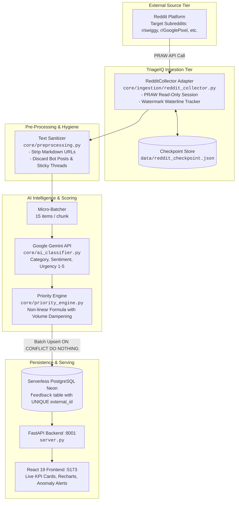
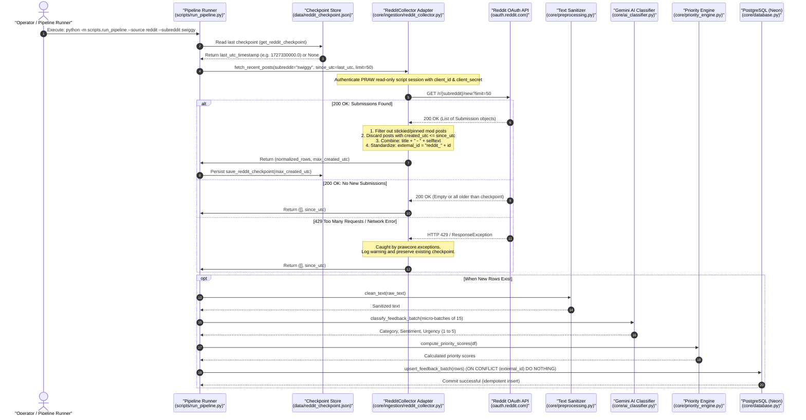

# TriageIQ: Reddit Live Ingestion Architecture & Implementation Guide

> **Document Version:** 1.0.0  
> **Target Audience:** Engineering Leads, System Architects, Full-Stack AI Engineers  
> **Status:** Implementation Blueprint & Architecture Specification  
> **Related Documents:** [TWITTER_INGESTION_ARCHITECTURE.md](./TWITTER_INGESTION_ARCHITECTURE.md) | [TWITTER_INGESTION_SEQUENCE_DIAGRAM.md](./TWITTER_INGESTION_SEQUENCE_DIAGRAM.md)

---

## 1. Executive Summary & Why Reddit is Ideal for TriageIQ

While Twitter/X has transitioned to an expensive pay-per-use model ($0.005 per post read), **Reddit maintains a generous, 100% free API tier** for non-commercial, personal, and portfolio applications (up to **100 requests per minute**).

### Why Reddit Fits TriageIQ Perfectly:
1. **High-Signal Customer Feedback:** Unlike short tweets, Reddit users post comprehensive bug reports, step-by-step reproduction flows, device specs, and detailed app complaints (e.g., in subreddits like `r/swiggy`, `r/GooglePixel`, `r/paytm`, `r/androidapps`).
2. **Built-in Channel Categorization:** Subreddits act as natural feedback namespaces (e.g., monitoring `r/swiggy` for delivery & payment issues).
3. **Zero Financial Cost:** Free developer credentials without credit card requirements.
4. **Deterministic PRAW Python Library:** Official support through `praw` (Python Reddit API Wrapper), handling OAuth2 token refresh and rate-limit backoffs automatically.

---

## 2. End-to-End System Architecture



---

## 3. End-to-End Ingestion Sequence Diagram



---

## 4. Step-by-Step Developer Setup (Getting Free Reddit API Keys)

Getting Reddit API credentials takes under 2 minutes:

### Step 4.1: Create a Reddit Developer Application
1. Log in to [Reddit](https://www.reddit.com) in your browser.
2. Navigate to the App Preferences page: **[https://www.reddit.com/prefs/apps](https://www.reddit.com/prefs/apps)**.
3. Scroll to the bottom and click the button: **"are you a developer? create an app..."** (or **"create another app..."**).
4. Fill in the form:
   - **name:** `TriageIQ-Feedback-Collector`
   - **App type:** Select the radio button **"script"** *(intended for personal/server scripts)*.
   - **description:** `Feedback intelligence and anomaly triage ingestion script for student hackathon project.`
   - **about url:** *(leave blank)*
   - **redirect uri:** `http://localhost:8080` *(required by Reddit form even for script type)*.
5. Click **"create app"**.

### Step 4.2: Retrieve Credentials
Once created, note down:
- **Client ID:** The string shown right under the app name (e.g. `k8F_x92JkLmN1A`).
- **Client Secret:** The field labeled **secret** (e.g. `W-8a7BcDeFgHiJkLmNoPqRsTuVw`).

---

## 5. Implementation Blueprint

### Step 1: Install `praw` Dependency
Add `praw` to your `requirements.txt`:
```txt
praw>=7.7.1
```
Install it in your virtual environment:
```bash
.\venv\Scripts\pip install praw
```

---

### Step 2: Environment Variables (`.env`)
Update your local `.env` file:
```env
# Reddit API Credentials (Free Tier)
REDDIT_CLIENT_ID="your_client_id_here"
REDDIT_CLIENT_SECRET="your_client_secret_here"
REDDIT_USER_AGENT="triageiq:v1.0 (by /u/your_reddit_username)"
REDDIT_SUBREDDITS="swiggy,zomato,GooglePixel"
REDDIT_MAX_POSTS="50"
```

---

### Step 3: Update Configuration (`core/config.py`)
Add the Reddit configuration keys in `core/config.py`:
```python
# Reddit API Ingestion
REDDIT_CLIENT_ID = os.getenv("REDDIT_CLIENT_ID", "")
REDDIT_CLIENT_SECRET = os.getenv("REDDIT_CLIENT_SECRET", "")
REDDIT_USER_AGENT = os.getenv("REDDIT_USER_AGENT", "triageiq:v1.0 (by /u/anonymous)")
REDDIT_SUBREDDITS = os.getenv("REDDIT_SUBREDDITS", "swiggy,GooglePixel")
REDDIT_MAX_POSTS = int(os.getenv("REDDIT_MAX_POSTS", "50"))
```

---

### Step 4: Implement Reddit Collector (`core/ingestion/reddit_collector.py`)

Create `core/ingestion/reddit_collector.py`:

```python
import logging
from datetime import datetime, timezone
from typing import List, Dict, Tuple
import praw
import prawcore
from core.config import (
    REDDIT_CLIENT_ID,
    REDDIT_CLIENT_SECRET,
    REDDIT_USER_AGENT,
)

logger = logging.getLogger("reddit_collector")

class RedditCollector:
    """Encapsulates Reddit API communication, subreddit scanning,
    watermark checkpointing, and payload normalization."""

    def __init__(
        self,
        client_id: str = REDDIT_CLIENT_ID,
        client_secret: str = REDDIT_CLIENT_SECRET,
        user_agent: str = REDDIT_USER_AGENT,
    ):
        if not client_id or not client_secret:
            raise ValueError("REDDIT_CLIENT_ID or REDDIT_CLIENT_SECRET is missing in .env.")

        self.reddit = praw.Reddit(
            client_id=client_id,
            client_secret=client_secret,
            user_agent=user_agent,
            check_for_async=False,
        )
        # Verify read-only access (no login required for public subreddits)
        self.reddit.read_only = True

    def fetch_recent_posts(
        self,
        subreddits: str | List[str],
        since_utc: float | None = None,
        limit: int = 50,
    ) -> Tuple[List[Dict], float | None]:
        """Fetches recent submissions from specified subreddits created after `since_utc`.

        Args:
            subreddits: A comma-separated string (e.g. 'swiggy+GooglePixel') or list of subreddit names.
            since_utc: Epoch timestamp of the newest post ingested in previous runs.
            limit: Maximum posts to fetch per batch (10 to 100).

        Returns:
            Tuple[List[Dict], float | None]: Standardized rows and the latest epoch timestamp watermark.
        """
        if isinstance(subreddits, list):
            sub_query = "+".join(subreddits)
        else:
            sub_query = subreddits.replace(",", "+").replace(" ", "")

        clamped_limit = max(10, min(limit, 100))
        logger.info(f"Querying Reddit: r/{sub_query}, since_utc={since_utc}, limit={clamped_limit}")

        try:
            subreddit = self.reddit.subreddit(sub_query)
            rows: List[Dict] = []
            max_utc = since_utc or 0.0

            for post in subreddit.new(limit=clamped_limit):
                # Ignore moderator stickied announcements
                if post.stickied:
                    continue

                # Watermark check: skip posts older than or equal to previous checkpoint
                if since_utc and post.created_utc <= since_utc:
                    continue

                # Track highest timestamp observed
                if post.created_utc > max_utc:
                    max_utc = post.created_utc

                # Concatenate title and body text for holistic feedback analysis
                full_text = post.title.strip()
                if post.selftext:
                    full_text += f"\n\n{post.selftext.strip()}"

                # ISO 8601 UTC timestamp
                created_dt = datetime.fromtimestamp(post.created_utc, timezone.utc)

                rows.append({
                    "source": "reddit",
                    "external_id": f"reddit_{post.id}",
                    "raw_text": full_text,
                    "created_at": created_dt.isoformat(),
                })

            newest_checkpoint = max_utc if max_utc > 0 else since_utc
            logger.info(f"Retrieved {len(rows)} new Reddit posts. New watermark: {newest_checkpoint}")
            return rows, newest_checkpoint

        except prawcore.exceptions.ResponseException as e:
            logger.error(f"Reddit API HTTP error: {e}", exc_info=True)
            return [], since_utc
        except prawcore.exceptions.OAuthException as e:
            logger.error(f"Reddit OAuth authentication failed. Check credentials: {e}")
            return [], since_utc
        except Exception as e:
            logger.error(f"Unexpected error fetching Reddit posts: {e}", exc_info=True)
            return [], since_utc
```

---

### Step 5: Dual-Mode Pipeline Integration (`scripts/run_pipeline.py`)

Enhance `scripts/run_pipeline.py` to allow running with `--source reddit`:

```python
import argparse
import json
import os
from core.ingestion.reddit_collector import RedditCollector
from core.config import REDDIT_SUBREDDITS

REDDIT_CHECKPOINT_FILE = "data/reddit_checkpoint.json"

def get_reddit_checkpoint() -> float | None:
    if os.path.exists(REDDIT_CHECKPOINT_FILE):
        try:
            with open(REDDIT_CHECKPOINT_FILE, "r") as f:
                return json.load(f).get("since_utc")
        except Exception:
            return None
    return None

def save_reddit_checkpoint(since_utc: float | None):
    if since_utc:
        os.makedirs(os.path.dirname(REDDIT_CHECKPOINT_FILE), exist_ok=True)
        with open(REDDIT_CHECKPOINT_FILE, "w") as f:
            json.dump({"since_utc": since_utc}, f)

# In main():
parser.add_argument(
    "--source",
    choices=["mock", "reddit", "twitter"],
    default="mock",
    help="Data ingestion source (default: mock)"
)
parser.add_argument(
    "--subreddits",
    type=str,
    default=REDDIT_SUBREDDITS,
    help="Subreddits to monitor when using --source reddit (comma separated)"
)

# Execution:
if args.source == "reddit":
    collector = RedditCollector()
    checkpoint = get_reddit_checkpoint()
    raw_rows, new_checkpoint = collector.fetch_recent_posts(
        subreddits=args.subreddits,
        since_utc=checkpoint,
        limit=args.rows
    )
    save_reddit_checkpoint(new_checkpoint)
```

---

## 6. How the Downstream Pipeline Automatically Works

Because `RedditCollector` emits the exact standard feedback dictionary contract:
```json
{
  "source": "reddit",
  "external_id": "reddit_1fqa9bc",
  "raw_text": "Delivery address reset bug - Anyone else having their saved address disappear?",
  "created_at": "2026-09-26T06:30:00+00:00"
}
```

The rest of the TriageIQ system requires **zero changes**:
1. **Sanitizer (`core/preprocessing.py`):** Cleans markdown links and formatting anomalies.
2. **Gemini Classifier (`core/ai_classifier.py`):** Automatically classifies the post as `Bug`, `Negative`, `Urgency: 4`.
3. **Priority Engine (`core/priority_engine.py`):** Ranks the item by urgency and volume.
4. **Anomaly Detector (`core/anomaly_detector.py`):** If multiple users post about payment or address issues in `r/swiggy` within 60 minutes, it flags a temporal cluster and generates incident ticket `TIQ-001`.
5. **React Dashboard:** Displays Reddit posts with a dedicated `reddit` source pill badge alongside existing mock and app store reviews.

---

## 7. Command Reference

```powershell
# 1. Run offline synthetic test (Free, deterministic)
python -m scripts.run_pipeline --source mock --rows 100 --spike 25

# 2. Run live Reddit ingestion from target subreddits
python -m scripts.run_pipeline --source reddit --subreddits "swiggy,GooglePixel" --rows 30

# 3. Start the FastAPI backend and React frontend
python run_app.py
```
