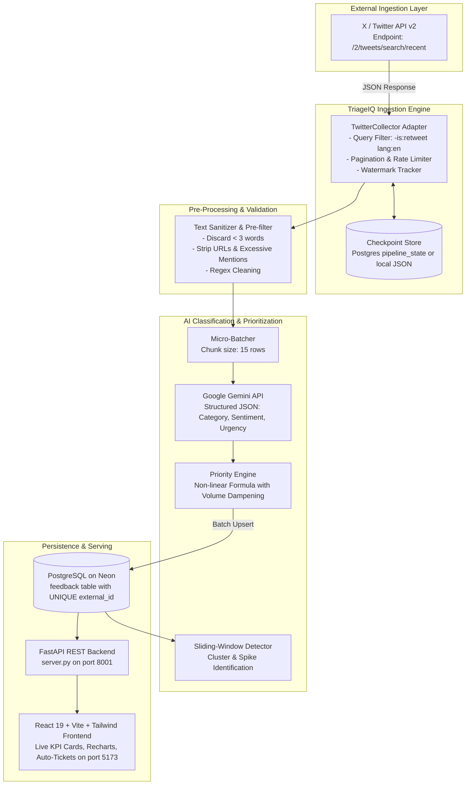
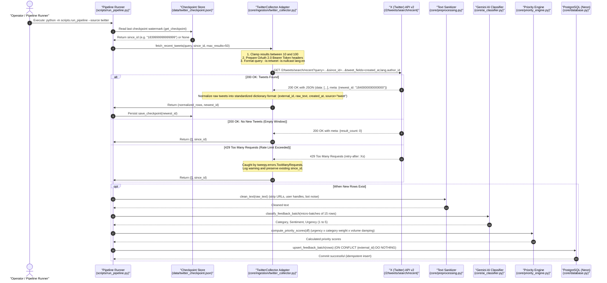

# TriageIQ: Twitter (X) Live Ingestion Architecture & Implementation Guide

> **Document Version:** 1.0.0  
> **Target Audience:** Engineering Leads, System Architects, Full-Stack AI Engineers  
> **Status:** Architecture Proposal & Implementation Blueprint  

---

## 1. Executive Summary & Objective

In **TriageIQ**, customer feedback currently originates from synthetic mock datasets generated by `data/mock_data_generator.py`. While synthetic data is ideal for deterministic offline testing and CI/CD validation, production product teams need direct ingestion of real-time public customer feedback from **X (formerly Twitter)**.

This document specifies the target architecture, data contract, database evolution, ingestion patterns, and operational guardrails required to fetch tweets directly from the X API v2 without disrupting existing priority scoring or anomaly detection workflows.

---

## 2. Architectural Comparison: Synthetic vs. Live Production

| Dimension | Current Synthetic Model (`mock_data_generator.py`) | Target Live Ingestion Model (`TwitterCollector`) |
| :--- | :--- | :--- |
| **Ingestion Type** | In-memory batch generation on demand | Incremental polling with watermark checkpointing (`since_id`) |
| **Data Lifecycle** | Destructive reload (`clear_feedback_table()`) | Idempotent upsert (`ON CONFLICT (external_id) DO NOTHING`) |
| **Noise Profile** | Pre-templated, clean sentences with known spike seed | Unstructured, bot spam, retweets, slang, URLs, mentions |
| **Rate Constraints** | Only bounded by local CPU and Gemini RPM | Bounded by X API rate tiers (15-min windows) + Gemini quotas |
| **Failure Modes** | Deterministic and controlled | HTTP 429 (rate limit), connection resets, token expiration |

---

## 3. End-to-End System Architecture



### 3.2. Detailed Ingestion Sequence Flow

For a full step-by-step lifecycle breakdown, see [TWITTER_INGESTION_SEQUENCE_DIAGRAM.md](./TWITTER_INGESTION_SEQUENCE_DIAGRAM.md).



---

## 4. Architectural Patterns & Core Decisions

### 4.1. Ingestion Pattern: Polled Search vs. Filtered Stream

1. **Option A: Filtered Stream (`/2/tweets/search/stream`)**
   - *Pros:* Near zero-latency push notifications.
   - *Cons:* Requires a persistent 24/7 background daemon, WebSocket/chunked HTTP supervision, automatic reconnection logic, and higher X Developer API tiers ($100+/month).
2. **Option B: Polled Recent Search (`/2/tweets/search/recent`) — [RECOMMENDED]**
   - *Pros:* Stateless, runs on demand or on a scheduled cron/worker, native compatibility with Free/Basic developer tiers, resilient against service reboots, zero infrastructure overhead.
   - *Cons:* Feedback arrives on polling intervals (e.g., every 5 to 15 minutes).

### 4.2. Ingestion Adapter Pattern
To maintain high modularity, data sources implement a common data contract. The downstream pipeline (`clean_text` -> `classify_feedback_batch` -> `compute_priority_scores` -> `insert_feedback_batch`) does not need to know where the text came from.

Standardized feedback dictionary format:
```json
{
  "source": "tweet",
  "external_id": "1840000000000000000",
  "raw_text": "Payment failed via UPI again! Error code 504.",
  "clean_text": "Payment failed via UPI again Error code 504",
  "created_at": "2026-09-25T05:00:00Z"
}
```

### 4.3. Watermark Checkpointing (`since_id`)
To prevent re-fetching and re-classifying existing tweets (which burns expensive Gemini tokens and wastes X API quotas):
- Store the `newest_id` returned in `response.meta.newest_id`.
- On subsequent requests, pass `since_id = <newest_id>`.
- If no checkpoint exists, supply `start_time` (e.g., past 24 hours).

---

## 5. Implementation Blueprint

### Step 1: Environment Variables (`.env`)
Add the following configuration keys:
```env
# X / Twitter API Credentials
TWITTER_BEARER_TOKEN="your_x_api_bearer_token"
TWITTER_QUERY="(to:YourApp OR @YourApp OR #YourApp) -is:retweet -is:nullcast lang:en"
TWITTER_MAX_RESULTS="50"
```

Update `core/config.py`:
```python
TWITTER_BEARER_TOKEN = os.getenv("TWITTER_BEARER_TOKEN", "")
TWITTER_QUERY = os.getenv("TWITTER_QUERY", "(to:YourApp OR @YourApp) -is:retweet lang:en")
TWITTER_MAX_RESULTS = int(os.getenv("TWITTER_MAX_RESULTS", "50"))
```

---

### Step 2: Database Schema Migration (Idempotency)

Update `core/models.py` to add `external_id` with a unique index:
```python
class FeedbackItem(Base):
    __tablename__ = "feedback"

    id = Column(Integer, primary_key=True, autoincrement=True)
    external_id = Column(String(100), unique=True, index=True, nullable=True)  # Tweet ID or ticket ID
    source = Column(String(50), nullable=False)        # app_review | tweet | support_ticket
    raw_text = Column(Text, nullable=False)
    clean_text = Column(Text, nullable=False)
    created_at = Column(DateTime, nullable=False, default=lambda: datetime.datetime.now(datetime.timezone.utc))
    category = Column(String(50), nullable=False, default="Uncategorized")
    sentiment = Column(String(20), nullable=False, default="Neutral")
    urgency_score = Column(Integer, nullable=False, default=1)
    priority_score = Column(Float, nullable=False, default=0.0)
```

Add an idempotent upsert function to `core/database.py`:
```python
from sqlalchemy.dialects.postgresql import insert

def upsert_feedback_batch(rows: list[dict]):
    """Idempotently inserts feedback rows.
    If external_id already exists, skips inserting to prevent duplicate records."""
    if not rows:
        return
    session = get_session()
    try:
        stmt = insert(FeedbackItem).values(rows)
        stmt = stmt.on_conflict_do_nothing(index_elements=['external_id'])
        session.execute(stmt)
        session.commit()
    finally:
        session.close()
```

---

### Step 3: Twitter Collector Implementation (`core/ingestion/twitter_collector.py`)

Create `core/ingestion/twitter_collector.py`:
```python
import logging
import tweepy
from typing import List, Dict, Tuple
from core.config import TWITTER_BEARER_TOKEN, TWITTER_QUERY

logger = logging.getLogger("twitter_collector")

class TwitterCollector:
    """Encapsulates X API v2 client communication, query formatting,
    pagination, and rate-limit handling."""

    def __init__(self, bearer_token: str = TWITTER_BEARER_TOKEN):
        if not bearer_token:
            raise ValueError("TWITTER_BEARER_TOKEN is not configured.")
        self.client = tweepy.Client(bearer_token=bearer_token, wait_on_rate_limit=True)

    def fetch_recent_tweets(
        self,
        query: str = TWITTER_QUERY,
        since_id: str | None = None,
        max_results: int = 50,
    ) -> Tuple[List[Dict], str | None]:
        """Fetches recent tweets matching the brand query since the last checkpoint.
        
        Returns:
            Tuple[List[Dict], str | None]: (standardized_rows, newest_tweet_id)
        """
        try:
            clamped_results = max(10, min(max_results, 100))
            logger.info(f"Querying X API: query='{query}', since_id={since_id}")

            response = self.client.search_recent_tweets(
                query=query,
                tweet_fields=["created_at", "lang", "author_id"],
                max_results=clamped_results,
                since_id=since_id
            )

            if not response.data:
                logger.info("No new tweets found matching the criteria.")
                return [], since_id

            rows = []
            for tweet in response.data:
                rows.append({
                    "source": "tweet",
                    "external_id": str(tweet.id),
                    "raw_text": tweet.text,
                    "created_at": tweet.created_at.isoformat(),
                })

            newest_id = str(response.meta.get("newest_id", since_id))
            logger.info(f"Successfully retrieved {len(rows)} tweets. New watermark: {newest_id}")
            return rows, newest_id

        except tweepy.errors.TooManyRequests:
            logger.warning("X API rate limit (429) hit. Pausing requests.")
            return [], since_id
        except Exception as e:
            logger.error(f"Unexpected error while querying X API: {e}", exc_info=True)
            return [], since_id
```

---

### Step 4: Pipeline Ingestion Runner (`scripts/run_pipeline.py`)

Enhance `scripts/run_pipeline.py` to support dual-mode execution via a `--source` flag:
```python
import json
import os
from core.ingestion.twitter_collector import TwitterCollector

CHECKPOINT_FILE = "data/twitter_checkpoint.json"

def get_checkpoint() -> str | None:
    if os.path.exists(CHECKPOINT_FILE):
        try:
            with open(CHECKPOINT_FILE, "r") as f:
                return json.load(f).get("since_id")
        except Exception:
            return None
    return None

def save_checkpoint(since_id: str | None):
    if since_id:
        os.makedirs(os.path.dirname(CHECKPOINT_FILE), exist_ok=True)
        with open(CHECKPOINT_FILE, "w") as f:
            json.dump({"since_id": since_id}, f)

# In run_pipeline main:
if args.source == "twitter":
    checkpoint = get_checkpoint()
    collector = TwitterCollector()
    raw_rows, newest_id = collector.fetch_recent_tweets(
        query=TWITTER_QUERY,
        since_id=checkpoint,
        max_results=args.rows
    )
    save_checkpoint(newest_id)
else:
    # Fallback to mock data generator
    raw_rows = generate_mock_data(n_general=args.rows, n_spike=args.spike)
```

---

## 6. Resilience, Security & Token Optimization

### 6.1. Pre-LLM Noise Filtering
Real tweets carry junk that wastes LLM token budgets. In `core/preprocessing.py`, add pre-classification filters:
- **Length Filter:** Discard messages with `< 3` meaningful words.
- **Mention Overload Filter:** Discard messages with `> 5` mentions (typically bot follow-trains or spam).
- **URL-Only Tweets:** Discard tweets that contain only a link and no complaint text.

### 6.2. Upstream 429 Rate Limiting
- `tweepy.Client(wait_on_rate_limit=True)` respects HTTP 429 backoff headers.
- Combine this with existing `GEMINI_RPM` client-side throttling in `core/config.py` to ensure neither the retrieval nor enrichment tier is throttled.

### 6.3. Zero-Downtime Local Development (Dual Mode)
Retaining `generate_mock_data()` side-by-side with `TwitterCollector` ensures:
1. Rahul and you can develop offline on flights or without active API credits.
2. Automated Pytest suites (`tests/test_priority_engine.py`, `tests/test_anomaly_detector.py`) continue passing with 100% deterministic test isolation.
3. Live demos can switch to live Twitter queries on demand.
