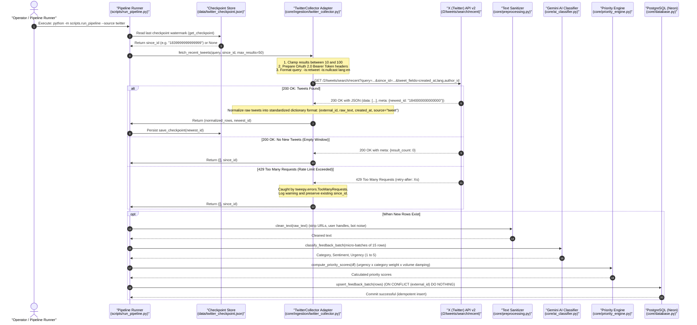

# TriageIQ: Twitter (X) Live Ingestion Sequence Diagram & Data Flow

> **Document Version:** 1.0.0  
> **Target Audience:** Engineering Leads, System Architects, Full-Stack AI Engineers  
> **Status:** Architecture Reference & Specification  
> **Related Document:** [TWITTER_INGESTION_ARCHITECTURE.md](./TWITTER_INGESTION_ARCHITECTURE.md)

---

## 1. Overview

This document provides a visual and operational specification of how the **TriageIQ** backend communicates with the **Twitter (X) API v2** endpoint (`/2/tweets/search/recent`). It details the step-by-step lifecycle from watermark checkpoint retrieval to AI classification, priority scoring, and idempotent persistence in PostgreSQL.

> [!TIP]
> **Viewing in VS Code:** Press `Ctrl + Shift + V` (or `Ctrl + K, V`) to open the Markdown Preview. VS Code and GitHub natively render the Mermaid diagram below.

---

## 2. End-to-End Sequence Diagram



---

## 3. Step-by-Step Architectural Lifecycle

### Phase 1: Watermark Retrieval (`since_id`)
1. Before initiating any outbound HTTP connection, `scripts/run_pipeline.py` checks `data/twitter_checkpoint.json`.
2. **First Run:** If no checkpoint exists, `since_id = None`. The query retrieves recent brand mentions from the past 7 days.
3. **Subsequent Runs:** If a watermark exists (e.g. `"1839999999999999"`), Twitter only returns tweets created *after* this ID. This guarantees:
   - Zero duplicate token consumption in Google Gemini.
   - Zero duplicate DB writes.
   - Conservation of limited monthly X API call limits.

### Phase 2: Client Configuration & Guardrails
In `core/ingestion/twitter_collector.py`:
1. **Authentication:** Authenticates with App-Only **OAuth 2.0 Bearer Token** (`TWITTER_BEARER_TOKEN`) using `tweepy.Client(wait_on_rate_limit=True)`.
2. **Boolean Query Filter:**
   ```
   (to:YourApp OR @YourApp OR #YourApp) -is:retweet -is:nullcast lang:en
   ```
   - `-is:retweet`: Discards retweets to avoid processing repetitive echo chambers.
   - `-is:nullcast`: Excludes dark/promotional ads.
   - `lang:en`: Restricts ingestion to English for structured Gemini prompt compatibility.
3. **Parameter Clamping:** Enforces `max(10, min(max_results, 100))` to strictly comply with X API v2 specification limits.

### Phase 3: Response Handling & Branching
The client dispatches `GET /2/tweets/search/recent` and handles three distinct scenarios:
- **Scenario A (Success - Data Returned):**
  - Extracts items from `response.data`.
  - Reads `response.meta["newest_id"]`.
  - Normalizes tweets into TriageIQ's standard schema contract.
  - Returns `(rows, newest_id)` and saves the updated watermark to disk.
- **Scenario B (Empty Window):**
  - `response.meta["result_count"] == 0`.
  - Returns `([], since_id)` without altering the checkpoint.
- **Scenario C (HTTP 429 Rate Limit):**
  - Trapped cleanly by `tweepy.errors.TooManyRequests`.
  - Logs a warning message and gracefully returns `([], since_id)` without terminating or crashing the backend.

### Phase 4: Downstream AI Enrichment & Storage
When new feedback items are retrieved:
1. **Sanitization (`core/preprocessing.py`):** Strips URLs, usernames, formatting anomalies, and bot noise.
2. **Micro-Batched AI Classification (`core/ai_classifier.py`):** Rows are grouped into chunks of **15 items per prompt** to reduce Gemini API calls by **~93%**, classifying each item into `category`, `sentiment`, and `urgency_score` (1–5).
3. **Priority Engine (`core/priority_engine.py`):** Calculates priority score:
   $$\text{priority\_score} = \text{urgency} \times \text{category\_weight} \times \left(1 + \frac{\sqrt{\text{volume}}}{10}\right)$$
4. **Idempotent Storage (`core/database.py`):** Rows are bulk inserted into PostgreSQL via:
   ```sql
   INSERT INTO feedback (...) VALUES (...) ON CONFLICT (external_id) DO NOTHING;
   ```
   Ensuring zero duplicate entries even if the pipeline is triggered repeatedly.
