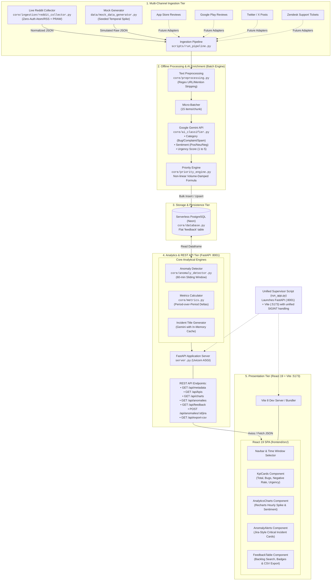
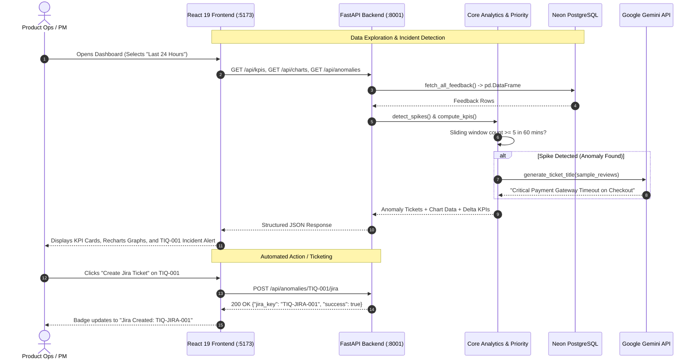

# TriageIQ: System Architecture & Engineering Blueprint

> **Project Name:** TriageIQ  
> **System Focus:** Digital Product Feedback Intelligence & Anomaly Triaging  
> **Target Audience:** Engineering Leads, System Architects, Full-Stack AI Engineers  
> **Document Status:** Authoritative Architecture Reference  

---

## 1. High-Level System Architecture Diagram

---

## 2. End-to-End Data Flow Sequence Diagram

---

## 3. Layer-by-Layer Architectural Breakdown

### 3.1. Ingestion & Preprocessing Tier
- **Live Reddit Collector (`core/ingestion/reddit_collector.py`):** Ingests real-time community bug reports and complaints from public subreddits (`r/swiggy`, `r/GooglePixel`). Operates in a dual mode:
  1. *Zero-Auth Atom/RSS Mode (Default):* Directly fetches official Reddit feeds (`/r/{sub}/new/.rss`) without needing developer keys, bypassing Reddit's Responsible Builder Policy restrictions.
  2. *PRAW OAuth Mode:* Automatically switches to authenticated sessions if `REDDIT_CLIENT_ID` and `REDDIT_CLIENT_SECRET` are configured.
  3. *Seed Fallback:* Serves curated domain complaints from `data/reddit_mock_posts.json` if network rate-limits (HTTP 429) occur.
- **Mock Data Engine (`data/mock_data_generator.py`):** Simulates multi-channel customer reviews (App Store, Google Play, Twitter/X, and Zendesk tickets) with seeded temporal clusters (e.g., sudden UPI checkout failure spikes).
- **Sanitization (`core/preprocessing.py`):** Strips URLs, usernames, formatting anomalies, and extra whitespace to minimize token waste before classification.

### 3.2. AI Intelligence Tier (`core/ai_classifier.py`)
- **LLM Foundation:** Google Gemini (`gemini-3.5-flash-lite` with automatic fallback to `gemini-2.5-flash`, `gemini-2.5-flash-lite`, and `gemini-flash-latest`).
- **Batched Ingestion:** Groups rows into chunks of **15 items per request**, slashing total LLM API calls by **~93%** (from ~370 to ~25).
- **Rate-Budget Throttling:** Client-side RPM limiter (`GEMINI_RPM=12`) prevents HTTP 429 quota exhaustion.
- **Output Schema:** Deterministic JSON parsing for `category`, `sentiment`, and `urgency_score` (1–5).

### 3.3. Mathematical Scoring & Anomaly Detection
- **Non-Linear Priority Engine (`core/priority_engine.py`):**
  $$\text{priority\_score} = \text{urgency\_score} \times \text{category\_weight} \times \left(1 + \frac{\sqrt{\text{volume}}}{10}\right)$$
  - Weights Bugs ($1.5$) and Complaints ($1.2$) over Praise ($0.3$) and Spam ($0.0$).
  - Sub-linear volume amplification ($\sqrt{\text{volume}}$) ensures systemic issues bubble up without letting isolated spam dominate.
- **Temporal Spike Detector (`core/anomaly_detector.py`):**
  - Evaluates rolling temporal windows (e.g., $\ge 5$ complaints in 60 minutes).
  - Compares against baseline volume to compute `% spike above norm` and auto-generate incident tickets (`TIQ-001`).

### 3.4. Storage & Persistence Tier (`core/database.py`, `core/models.py`)
- **Database:** Serverless PostgreSQL on **Neon**.
- **Schema:** Single flat `feedback` table for zero-join latency and instant conversion into Pandas dataframes for mathematical processing.
- **Engine Configuration:** SQLAlchemy with `pool_pre_ping=True` to eliminate stale serverless connection drops.

### 3.5. Analytics & REST API Tier (`server.py`)
- **Web Server:** **FastAPI + Uvicorn** listening on port `8001`.
- **API Surface:**
  - `GET /api/metadata`: Dynamic filters, categories, and time windows.
  - `GET /api/kpis`: 4 KPI metrics with period-over-period percentage deltas.
  - `GET /api/charts`: Hourly timeline + spike annotation, sentiment distribution, and source breakdowns.
  - `GET /api/anomalies`: Active incident tickets with AI-generated titles & sample reviews.
  - `POST /api/anomalies/{ticket_id}/jira`: Simulated 1-click Jira ticket dispatch (`TIQ-JIRA-XXX`).
  - `GET /api/feedback`: Paginated, multi-faceted filtered backlog.
  - `GET /api/export-csv`: CSV export with active filters.

### 3.6. Presentation Tier (`frontend/`)
- **Framework:** **React 19 + TypeScript + Vite 8**.
- **Styling:** **Tailwind CSS** with dark-mode theme, custom status pills, and badges.
- **Data Visualization:** **Recharts** for interactive hourly timelines with peak spike annotations and sentiment distribution.
- **Supervisor Runner (`run_app.py`):** A unified Python process supervisor that concurrently starts the FastAPI backend on port 8001 and the Vite development server on port 5173 with clean termination handling.
